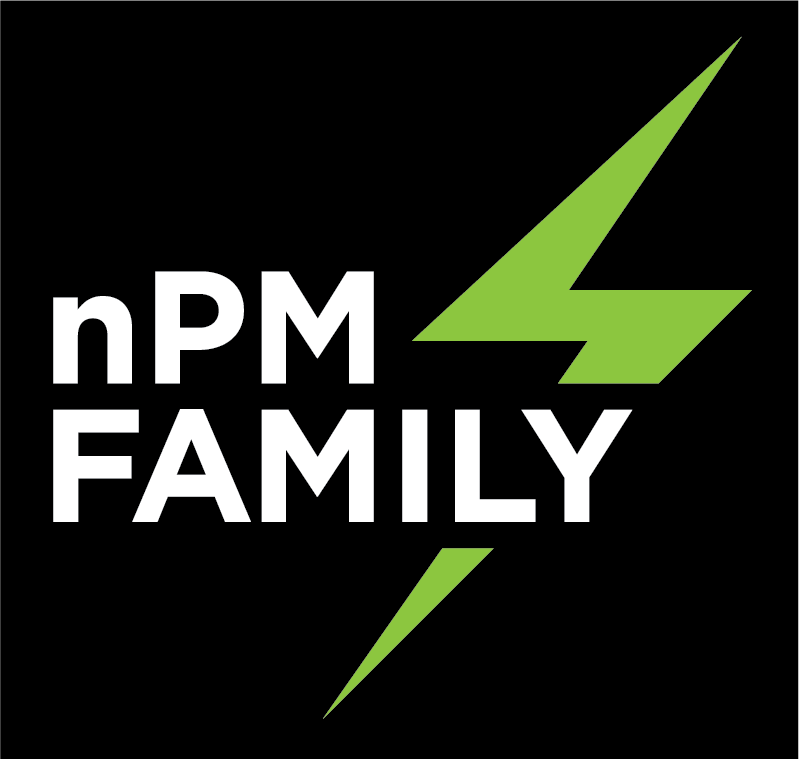

# npmx-zephyr

<p align="center">
    
</p>

## Overview
npmx-zephyr repository provides an example of [npmx library][npmx_repo] integration with the [Zephyr][zephyr_site] RTOS environment. This can be used as a starting point for an integration with other RTOS or bare-metal environments.

For the user's convenience, this repository includes also a variety of sample applications demonstrating how to use the [npmx drivers][npmx_drivers].

## Supported devices
 -    nPM1300 Engineering C

## How to use

### Repository initialization
The recommended way to clone the repositories is by using the `west` tool. Information about the installation, available commands, configuration and more can be found in the [Zephyr's west][west_doc] tool documentation.

To initalize the npmx-zephyr repository, run the following commands:

```bash
mkdir <new_directory>
cd <new_directory>
west init -m https://github.com/NordicSemiconductor/npmx-zephyr
cd npmx-zephyr
west update
```
Alternatively, you can clone repositories by using git only. In this case pay special attention to revisions - both Zephyr and npmx revisions should match the ones specified in the `west.yml`. Moreover, the `npmx` folder should be placed in the `zephyr/modules` subdirectory.

### Building and running sample application
To run one of the [sample applications][samples_dir], do the following:

* Configure the setup based on the relevant sample documentation.
* Build and flash the application to the target device by using the following commands:
    ```bash
    cd <path_to_npmx-zephyr>/samples/<desired_sample>
    west build -b <target>
    west flash
    ```

For instance, if you want to run the LED sample for nPM1300 Engineering C used with nRF52840DK, you must configure the setup as specified in the [LED sample README][led_readme]. After that, run the following commands:
```bash
cd npmx-zephyr/samples/led
west build -b nrf52840dk_nrf52840
west flash
```

As a result, you should see LEDs blinking on the board.

>Make sure that the ``ZEPHYR_BASE`` variable is set as a path to your Zephyr folder (the one you have cloned with west).
>
>If not, set this variable manually with the following command:
>
>```bash
>export ZEPHYR_BASE=<path_to_zephyr_directory>
>```

If you want to create a custom application, refer to the following guidelines:
- [npmx Github repository][npmx_repo] for API usage
- [nPM1300 documentation][nPM1300_documentation] for the required setup configuration

## Directories
```
.
├── doc         # Project documentation files
├── drivers     # npmx drivers files
├── dts	        # Devicetree source files for nPM devices
├── samples     # npmx samples files
│   ├── buck    # Samples related to BUCK peripheral
│   ├── ldo     # Samples related to LDO peripheral
│   .
│   .
│
├── scripts     # Various scripts
└── zephyr      # Zephyr configuration files
```

## Generating documentation
All files that are required to compile the Sphinx-based documentation for the `npmx-zephyr` repository are located under the [doc][doc_dir] folder.

### Requirements
Install Python 3 and its dependencies with the following command:
```bash
pip install -r scripts/requirements.txt
```

### Build
You can build the documentation in two ways:

* Use the provided script `doc/sphinx_build_local.sh` and open the `doc/build/html/index.html` file to see the output.
* Build it manually by going to the `doc` directory and running the following command:

    ```bash
    sphinx-build -M html . build
    ```

## pre-commit
For smoother workflow, `npmx-zephyr` includes hook scripts that are managed by using the `pre-commit` framework. These scripts help to identify common issues, such as trailing whitespaces or missing licenses, right before the code review.

Information about the usage, available commands, configuration and more can be found on the [pre-commit page][pre_commit_website].

To enable or disable the pre-commit functionality, run the relevant command:

```bash
pre-commit install
pre-commit uninstall
```

[doc_dir]: doc
[nPM1300_documentation]: https://infocenter.nordicsemi.com/index.jsp?topic=%2Fstruct_pmic%2Fstruct%2Fnpm1300.html
[led_readme]: samples/led/README.rst
[npmx_drivers]: https://github.com/NordicSemiconductor/npmx
[npmx_repo]: https://github.com/NordicSemiconductor/npmx-zephyr
[pre_commit_website]: https://pre-commit.com/
[samples_dir]: samples
[west_doc]: https://docs.zephyrproject.org/latest/develop/west/index.html
[zephyr_site]: https://zephyrproject.org/
