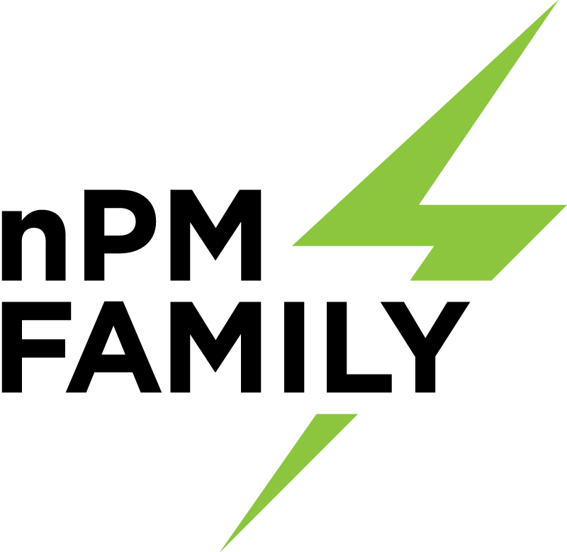

.. _index:

npmx-zephyr
###########

Overview
********

:ref:`npmx-zephyr <index>` provides an example of `npmx library`_ integration with the `Zephyr`_ RTOS environment.
This can be used as a starting point for an integration with other RTOS or bare-metal environments.

For the user's convenience, this repository includes also a variety of sample applications demonstrating how to use the `npmx drivers`_.
Their code is available on the GitHub `npmx-zephyr repository`_.

Supported devices
*****************

- nPM1300 Engineering B

Supported drivers
*****************

The following matrix provides a comparative overview of which drivers are supported by specific Nordic nPMs.

 ======================= ===== ====== ========= ======= ====== ====== ===== ===== ====== ======= ========
         Driver           ADC   BUCK   CHARGER   EVENT   GPIO   LDSW   LED   POF   SHIP   TIMER   VBUSIN
 ======================= ===== ====== ========= ======= ====== ====== ===== ===== ====== ======= ========
  nPM1300 Engineering B    ✔     ✔        ✔        ✔      ✔      ✔      ✔     ✔     ✔       ✔       ✔
 ======================= ===== ====== ========= ======= ====== ====== ===== ===== ====== ======= ========

For more information about the features of a specific peripheral, refer to the official documentation of the specific nPM device.

How to use
**********

Repository initialization
=========================

The recommended way to clone the repositories is by using the ``west`` tool.
Information about the installation, available commands, configuration and more can be found in the `Zephyr's west`_ tool documentation.

To initalize the npmx-zephyr repository, run the following commands:

.. code:: bash

   mkdir <new_directory>
   cd <new_directory>
   west init -m https://github.com/NordicSemiconductor/npmx-zephyr
   cd npmx-zephyr
   west update

Alternatively, you can clone repositories by using git only.
In this case pay special attention to revisions - both Zephyr and npmx revisions should match the ones specified in the ``west.yml``.
Moreover, the ``npmx`` folder should be placed in the ``zephyr/modules`` subdirectory.

Building and running sample application
=======================================

To run one of the :doc:`sample applications <samples>`, do the following:

* Configure the setup based on the relevant sample documentation.
* Build and flash the application to the target device by using the following commands:

  .. code:: bash

     cd <path_to_npmx-zephyr>/samples/<desired_sample>
     west build -b <target>
     west flash

For instance, if you want to run the LED sample for nPM1300 Engineering B used with nRF52840DK, you must configure the setup as specified in the :doc:`LED sample <../samples/led/README>` description.
After that, run the following commands:

.. code:: bash

   cd npmx-zephyr/samples/led
   west build -b nrf52840dk_nrf52840
   west flash

As a result, you should see LEDs blinking on the board.

.. note::
   Make sure that the ``ZEPHYR_BASE`` variable is set as a path to your Zephyr folder (the one you have cloned with west).

   If not, set this variable manually with the following command:

   .. code:: bash

      export ZEPHYR_BASE=<path_to_zephyr_directory>

Generating documentation
========================

All files that are required to compile the Sphinx-based documentation for the ``npmx-zephyr`` repository are located under the ``doc`` folder.

Requirements
------------

Install Python 3 and its dependencies with the following command:

.. code:: bash

   pip install -r scripts/requirements.txt

Build
-----

You can build the documentation in two ways:

* Use the provided script ``doc/sphinx_build_local.sh`` and open the ``doc/build/html/index.html`` file to see the output.
* Build it manually by going to the ``doc`` directory and running the following command:

  .. code:: bash

     sphinx-build -M html . build

.. toctree::
   :maxdepth: 2
   :caption: Contents:

   samples

.. toctree::
   :maxdepth: 1

   additional_resources
   release_notes
